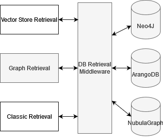

<div align="center">


## A Unified Library of Retrieval-Augmented Generation Techniques with Implementations, Comparisons, and a Practical Selection Guide


<div align="center">
  <div style="width: 100%; height: 2px; margin: 20px 0; background: linear-gradient(90deg, transparent, #00d9ff, transparent);"></div>
</div>


<div align="center">
  <div style="background: linear-gradient(135deg,rgb(102, 219, 234, 0.3) 0%,rgb(43, 170, 255, 0.3) 60%); border-radius: 15px; padding: 25px; text-align: center;">
    <p>
      
      <a href="https://pypi.org/project/"></a>
    </p>
  </div>
</div>
</div>
<div align="center" style="margin: 30px 0;margin: 0 auto;">
  
</div>
<div align="center" style="margin: 10px 0;">
    
</div>


## 🔧 Getting Started

To preview the documentation locally:

1. **Install the required dependencies listed in 'requirements.txt' .**

```py
pip install -r requirements.txt
```

You can install the minimal requirements for the documentation page using:

```py
pip install mkdocs mkdocs-material mkdocs-jupyter
```

2. **Start the development server:**

```py
mkdocs serve
```

3. **Open your browser and navigate to:** [http://127.0.0.1:8000](http://127.0.0.1:8000)

   The documentation will automatically reload as you edit the files

## 🔧 Build the Documentation (Optional)

To build the static site for deployment:

```py
mkdocs build
```

The site will be generated in the `site/` directory.

---

## 🚀 Quickstart Guide
+ Check out the [Notebook](/raglib/pipeline-test.ipynb)
+ See the slides for more information (RAGLIB.pptx)