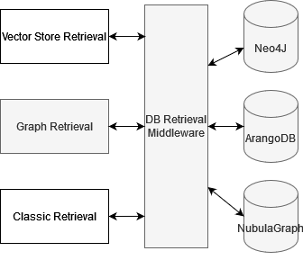

<div align="center">

<div style="margin: 3px 0;">
  
</div>


# 🏛️ RAGLib
## A Unified Library of Retrieval-Augmented Generation Techniques with Implementations, Comparisons, and a Practical Selection Guide


<div align="center">
  <div style="width: 100%; height: 2px; margin: 20px 0; background: linear-gradient(90deg, transparent, #00d9ff, transparent);"></div>
</div>


<div align="center">
  <div style="background: linear-gradient(135deg,rgb(102, 219, 234, 0.3) 0%,rgb(43, 170, 255, 0.3) 60%); border-radius: 15px; padding: 25px; text-align: center;">
    <p>
      
      <a href="https://pypi.org/project/"></a>
    </p>
  </div>
</div>
</div>
<div align="center" style="margin: 30px 0;margin: 0 auto;">
  
</div>
<div align="center" style="margin: 30px 0;">
    
</div>


## 🔧 Getting Started

To preview the documentation locally:

1. **Install the required dependencies listed in 'requirements.txt' .**

```py
pip install -r requirements.txt
```

You can install the minimal requirements for the documentation page using:

```py
pip install mkdocs mkdocs-material mkdocs-jupyter
```

2. **Start the development server:**

```py
mkdocs serve
```

3. **Open your browser and navigate to:** [http://127.0.0.1:8000](http://127.0.0.1:8000)

   The documentation will automatically reload as you edit the files

## 🔧 Build the Documentation (Optional)

To build the static site for deployment:

```py
mkdocs build
```

The site will be generated in the `site/` directory.

---

## 🚀 Quickstart Guide
+ Check out the [Notebook](/raglib/pipeline-test.ipynb)
+ See the slides for more information (RAGLIB.pptx)
  

## Provided retrieval implementations

### RAG

A naive rag implementation. All files are read and their content is split into chunks, preserving chapters where possible. Their embeddings are then stored into an Elasticsearch database, which will be queried for every user prompt.

### GRAPH RAG

An implementation inspired by [Graph RAG by Microsoft](https://arxiv.org/abs/2404.16130). The data is read and transformed into a knowledge graph, stored in ArangoDB. The resulting nodes are then grouped by their topic and summarized. These summarizations will then by used during query time to find relevant information, using a llm to judge the importance of the information.

This kind of initialization takes very long, but might be worth it, as following querys are not matched by text similiarity but by the topic they reside in. The generated knowledge graph is shared between Graph Rag, Graph Rag Rag and Garag. When using this implementation, keep in mind that a longer retrieval time is expected.

### NAIVE GRAPH RAG

An implementation reducing the query time of the Graph Rag implementation. Instead of an llm judging the importance of the information, vector similiarity is used to search for important communities. The information summaries of the communities is then returned to the user. Therefor this approach can be seen as a naive rag approach on community summaries. While this implementation reduces retrieval time compared to Graph RAG, precision on non global questions is reduced.

### GARAG

An implementation reducing the halucination of the filtered information. Important communities are first found, using the Graph Rag Rag approach. Then the original document contents are ranked by influence on these summaries and the top results are returned to the user. Therefor this approach can be seen as Graph-Assisted RAG (or GARAG). It is recommended to use this method, as it combines a very fast retrieval time with good precision. 
