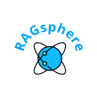

<div align="center">




## A Unified Library of Retrieval-Augmented Generation Techniques with Implementations, Comparisons, and a Practical Selection Guide


<div align="center">
  <div style="width: 100%; height: 2px; margin: 20px 0; background: linear-gradient(90deg, transparent, #00d9ff, transparent);"></div>
</div>


<div align="center">
  <div style="background: linear-gradient(135deg,rgb(102, 219, 234, 0.3) 0%,rgb(43, 170, 255, 0.3) 60%); border-radius: 15px; padding: 25px; text-align: center;">
    <p>
      
      <a href="https://pypi.org/project/"></a>
    </p>
  </div>
</div>
</div>
<div align="center" style="margin: 30px 0;margin: 0 auto;">
  
</div>

---

## 🚀 Quickstart

All instructions, usage guides, and examples for RAG-Sphere are available in the official documentation.

👉 **Get started here:** [https://dlr-sc.github.io/RAG-Sphere/](https://dlr-sc.github.io/RAG-Sphere/)

This page contains everything you need to install RAG-Sphere and build your first pipeline.

---

## 📦 Installation

Clone the repository and install locally:

```bash
git clone https://github.com/DLR-SC/RAG-Sphere.git
cd RAG-Sphere
pip install .
```

---

## 📄 License

This project is licensed under the MIT License.